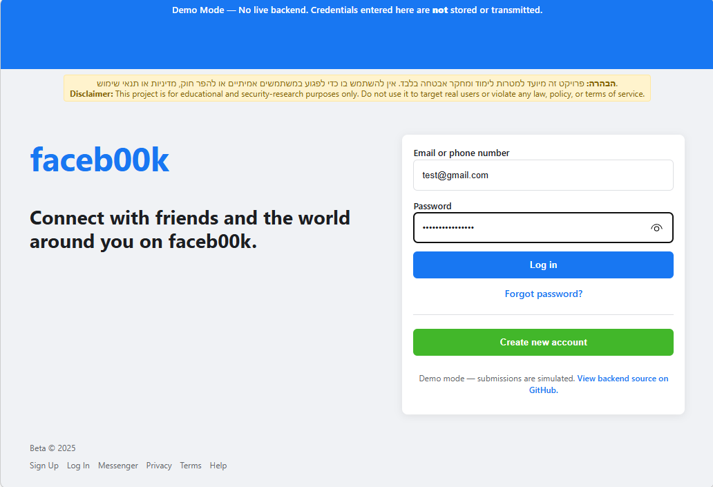
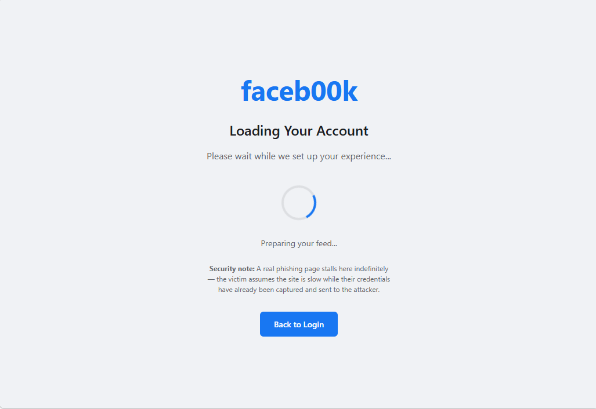
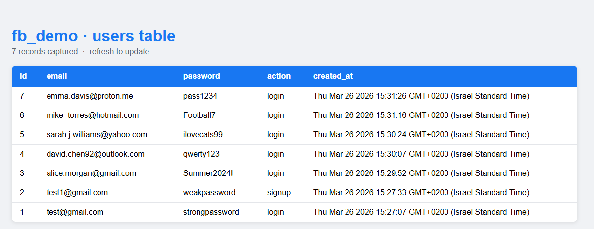

# faceb00k Login Demo

A demonstration web application that mimics Facebook's login and registration flow. Built as a system defence assignment at Ben-Gurion University (BGU) to showcase web development practices and highlight security considerations in user authentication and data handling.

**[Live Demo](https://yarin-lab.vercel.app/faceb00k/)** | BGU Security Assignment

---

## Screenshots

### Login page


### Loading screen (victim stall)


### Captured credentials in MySQL


---

## How It Works

| Layer | File | Description |
|-------|------|-------------|
| Frontend | `index.html` | Login form styled like Facebook |
| Backend | `server.js` | Node.js + Express REST API |
| Database | MySQL | Auto-created `fb_demo` database with `users` table |
| Security | — | Passwords stored as plain text; SQL queries are parameterized |

## API Endpoints

| Method | Endpoint | Description |
|--------|----------|-------------|
| `POST` | `/api/auth/register` | Creates a new user account |
| `POST` | `/api/auth/login` | Authenticates an existing user |
| `GET` | `/api/auth/users` | Returns all users (id, email, action_type, created_at) |

`action_type` values: `signup` — user clicked "Create new account"; `login` — user clicked "Log in".

---

## Prerequisites

### 1. Node.js
- Download the LTS version from [nodejs.org](https://nodejs.org)
- Run the installer, follow the wizard, then **restart your computer**

### 2. MySQL
- Download "MySQL Installer for Windows" from [dev.mysql.com](https://dev.mysql.com/downloads/installer/)
- Choose "Developer Default" setup
- Set a root password when prompted — remember it

### 3. Code Editor (optional)
- [Visual Studio Code](https://code.visualstudio.com/) is recommended

---

## Setup

### Step 1: Verify installations

```bash
node --version
npm --version
mysql --version
```

All three should print version numbers. If any fail, restart your computer and try again.

### Step 2: Start MySQL

1. Press `Win + R`, type `services.msc`, press Enter
2. Find "MySQL80" (or "MySQL") in the list
3. Right-click → **Start** if it isn't already running

### Step 3: Configure environment

```bash
# Navigate to the project folder
cd path/to/faceb00k.com

# Copy the example env file
copy example.env .env

# Open it and set your MySQL password
notepad .env
```

Change `your_mysql_password` to the password you chose during MySQL installation.

### Step 4: Install dependencies

```bash
npm install
```

This downloads Express, the MySQL driver, bcrypt, and other required packages.

### Step 5: Start the server

```bash
npm start
```

You should see: `Server listening on http://localhost:3001`

### Step 6: Test the application

1. Open `index.html` in your browser
2. Click **Create new account** to register a test user
3. Log in with the same credentials — you should see a success alert

---

## Viewing Database Records

### MySQL command line

```bash
# All users
mysql -u root -p -e "USE fb_demo; SELECT * FROM users;"

# Without password hashes
mysql -u root -p -e "USE fb_demo; SELECT id, email, created_at FROM users;"

# Count total users
mysql -u root -p -e "USE fb_demo; SELECT COUNT(*) FROM users;"
```

### MySQL Workbench (GUI)

1. Open MySQL Workbench and connect to your local instance
2. Navigate to the `fb_demo` database
3. Right-click the `users` table → **Select Rows – Limit 1000**

### Built-in API endpoint

```
GET http://localhost:3001/api/auth/users
```

Returns JSON with all users including id, email, action_type, and created_at.

---

## Resetting the Database

```bash
# Remove all data, keep table structure
mysql -u root -p -e "USE fb_demo; DELETE FROM users;"

# Drop and recreate the table on next server start
mysql -u root -p -e "USE fb_demo; DROP TABLE users;"

# Drop the entire database (server recreates it on next start)
mysql -u root -p -e "DROP DATABASE fb_demo;"

# Delete a specific user
mysql -u root -p -e "USE fb_demo; DELETE FROM users WHERE email = 'user@example.com';"
```

After any reset, run `npm start` — the server will recreate the database and table automatically.

---

## Troubleshooting

| Error | Fix |
|-------|-----|
| `npm is not recognized` | Restart after installing Node.js |
| `MySQL connection failed` | Check service is running in `services.msc`; verify password in `.env` |
| `Port 3001 already in use` | Set `PORT=3002` in `.env` |
| `Cannot find module` | Run `npm install` from the project folder |

---

## Author

**Yarin Solomon** — Full Stack Developer

- Email: [yarinso39@gmail.com](mailto:yarinso39@gmail.com)
- GitHub: [github.com/yarins0](https://github.com/yarins0)
- LinkedIn: [linkedin.com/in/yarin-solomon](https://www.linkedin.com/in/yarin-solomon/)
- Portfolio: [YOUR_PORTFOLIO_https://yarin-lab.vercel.app/URL](https://yarin-lab.vercel.app/)

*This project was created for educational purposes as part of a system defence assignment at BGU.*
